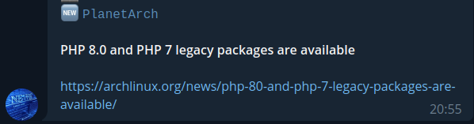

# RTT - Telegram feed reader

Simple Rss feed reader for telegram
Based on the fantastic work of [brokenpip3/rtt](https://github.com/brokenpip3/rtt)



## Usage

Environment variables:

* `TGTOKEN`: telegram bot token
* `TGCHAT`: the chat id where the bot send the notifications, the bot must be a member
* `CONFIGFILE`: optional, where the config file is placed, default "/usr/src/app/settings.yaml"
* `DBFILE`: optional, sqlite db path, default "/tmp/rtt.sqlite"

### Docker

docker compose example:

```shell
version: '3.3'
services:
  rtt:
    environment:
      - TGTOKEN=foo
      - TGCHATID=bar
    volumes:
      - "${PWD}/example-settings.yaml:/usr/src/app/settings.yaml"
      - rttdata:/tmp
    image: brokenpip3/rtt:0.0.2

volumes:
  rttdata:
```

### Kubernetes

See [kubernetes](./kubernetes) directory for example deployment

## Credits

1. [Never miss magazines article - Fedora Magazine](https://fedoramagazine.org/never-miss-magazines-article-build-rss-notification-system/)
2. [brokenpip3/rtt](https://github.com/brokenpip3/rtt)